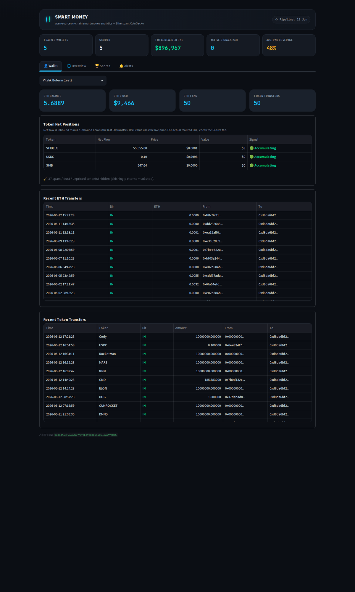

# onchain-smart-money

[](https://github.com/hakan-tasar12/onchain-smart-money/actions/workflows/ci.yml)

Open-source on-chain tracker for Ethereum wallets. Tracks token flows, computes realized PnL with a FIFO engine, scores wallets on four metrics, sends Telegram alerts when 2+ wallets accumulate the same token, and answers on-demand queries through an interactive Telegram bot.



## How it works

The tracker reads ETH balances and ERC-20 transfers from Etherscan, stores 12 months of history in SQLite, and computes the net position per token to flag each wallet as accumulating or distributing. On top of that, a FIFO PnL engine prices each lot, a daily job scores every wallet, and consensus alerts fire when independent wallets converge on the same token.

## Methodology

PnL and scoring rest on a few explicit conventions — stated here so the numbers
can be read correctly:

- **Pricing.** Tokens are priced by **contract address, not symbol**, so a
  symbol-spoofed scam token can never match a legitimate one. Historical PnL uses
  CoinGecko **daily-close** prices — not the actual swap execution price — so
  realized figures are *approximate*, not exact accounting.
- **FIFO matching.** Buys open lots; sells consume the oldest open lots first.
  Realized PnL = proceeds − cost basis of the consumed lots, over a rolling
  **12-month window**.
- **Exact arithmetic.** All money and amount math runs in Python's `decimal.Decimal`,
  not binary `float`: a fill sums its cost basis across many lots, and float would
  accumulate rounding error over those additions. Values are stored in SQLite as
  their Decimal string form, so they round-trip exactly.
- **Unknown cost basis.** If a sell has no matching lot (the position was opened
  before the 12-month window), it is recorded as *unmatched* and **excluded from
  PnL — not set to zero**. The **Coverage %** reported per wallet is the fraction
  of sells with a known cost basis, i.e. how much to trust that wallet's PnL.
- **Missing prices never invent PnL.** When CoinGecko has no price for a token on a
  trade's day, that trade is recorded as `no_price` and **excluded from PnL**, never
  realized at a fabricated $0 (which would book a phantom gain or loss). A missing
  price lowers Coverage % rather than corrupting the number.
- **Wash-trade guard.** Sells against a lot younger than **60 seconds** are
  skipped, to drop intraday round-trips and arbitrage noise.
- **Spam filtering.** Tokens absent from CoinGecko are dropped; a regex catches
  phishing names ("claim", "reward", URL patterns).

## Assumptions & limitations

Stated up front, because what a model *doesn't* do matters as much as what it does:

- Prices are **daily-close approximations**, not execution prices — realized PnL is
  indicative, not reconciled accounting.
- **Gas fees and transaction costs are not modeled.**
- **MEV, sandwiching, and internal contract transfers** are not accounted for.
- The dominant source of approximation is the **price feed** (daily close), not the
  arithmetic: the FIFO accounting itself is computed in `Decimal` and persisted
  exactly (see Methodology), so the matching adds no rounding error of its own.
- **Daily price granularity** ignores intraday moves; sub-day trades are valued at
  the day's close.
- Positions opened before the 12-month window have unknown cost basis and are
  excluded (see Coverage above).
- This is an **analytics tool, not a trading system, and not financial advice.**

## Setup

```bash
git clone https://github.com/hakan-tasar12/onchain-smart-money.git
cd onchain-smart-money
python3 -m venv .venv && source .venv/bin/activate
pip install -r requirements.txt
cp .env.example .env
```

Add your API keys to `.env`, then add wallet addresses to `watchlist.txt`.

## Running

```bash
streamlit run app.py     # dashboard at http://localhost:8501
python run_hourly.py     # ingest + alerts
python run_daily.py      # PnL + scoring (first run: 5-10 min)
python run_bot.py        # interactive Telegram bot (long-running)
```

VPS scheduler + bot service: `bash deploy/setup_systemd.sh`

## Telegram bot

The dashboard needs a laptop and an SSH tunnel; the bot is the interface from
your phone. It **long-polls** the Telegram API — no inbound port, no public
webhook — and replies **only** to the chat IDs in `TELEGRAM_CHAT_ID`
(comma-separated), so the token alone can't expose your positions.

| Command | What it returns |
|---|---|
| `/top` | Best-performing watched wallets, by composite score |
| `/wallet <name>` | A wallet's realized PnL, coverage, and top wins/losses |
| `/token <symbol>` | Which watched wallets hold a token (consensus check) |
| `/movers` | Recent consensus accumulations (≥2 wallets, last 48h) |
| `/help` | Lists every command |

Consensus accumulations and alerts **exclude stablecoins** (USDC, USDT, DAI, …):
a wallet receiving USDC is parking cash, not making a directional bet, so it carries
no conviction signal.

Consensus alerts carry inline buttons (**📊 Holders**, **🏆 Top**) that drill
into the same queries without typing. Commands are read-only and reuse the same
`src/db` functions the dashboard reads from.

## Files

| File | What it does |
|---|---|
| `src/etherscan.py` | Etherscan API wrapper |
| `src/prices.py` | CoinGecko price lookup by contract address |
| `src/wallet.py` | Net position, spam filter |
| `src/db.py` | SQLite init and CRUD |
| `src/ingest.py` | Etherscan to SQLite |
| `src/pnl.py` | FIFO PnL engine |
| `src/scoring.py` | Wallet scoring |
| `src/telegram_api.py` | Low-level Telegram Bot API client (shared) |
| `src/alerts.py` | Consensus accumulation alerts |
| `src/bot.py` | Interactive bot: commands, auth, long-poll loop |
| `run_hourly.py` | Ingest + alerts |
| `run_daily.py` | PnL + scoring |
| `run_bot.py` | Telegram bot entry point |
| `app.py` | Streamlit dashboard |

## Stack

Python, SQLite, Etherscan API, CoinGecko API, pandas, Streamlit, Telegram Bot API

## Tests

The FIFO accounting core ([`src/fifo.py`](src/fifo.py)) is pure and side-effect
free, so the PnL math is verified against hand-computed examples — FIFO ordering
across lots, partial fills, the wash-trade guard, unmatched (pre-window) sells, and
exact `Decimal` arithmetic (no float accumulation error). A second suite checks that
the engine persists those results correctly through the SQLite layer:

```bash
pip install -r requirements-dev.txt
pytest
```

## Roadmap

- [x] A — Watchlist tracker
- [x] B — Smart money dashboard (current)
- [ ] C — Alpha discovery engine

## License

MIT — see [LICENSE](LICENSE).
